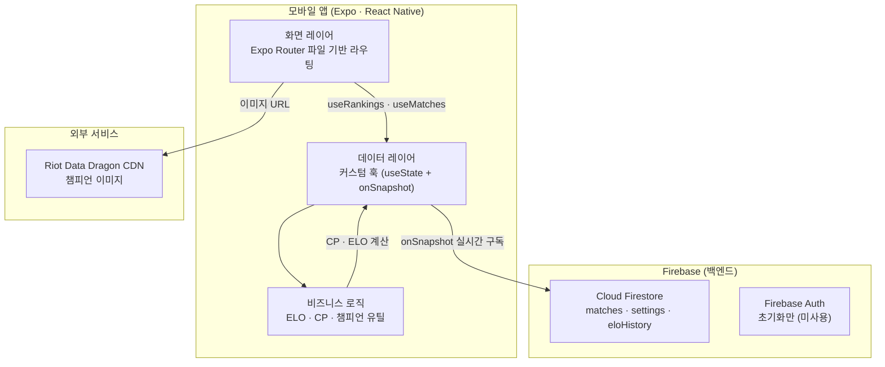
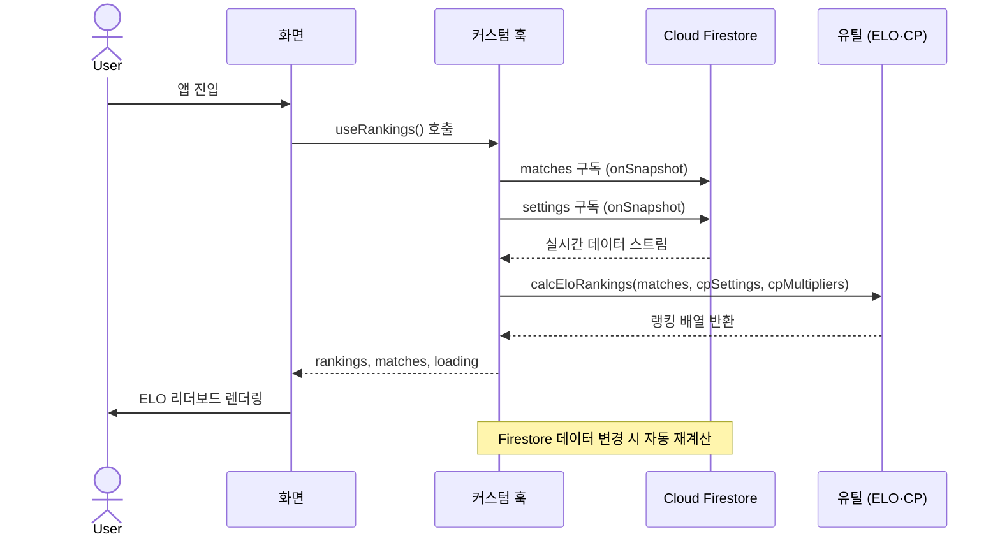

# 시스템 아키텍처

---

## 1. 전체 구조도



---

## 2. 레이어별 책임

### 2.1 화면 레이어 — `app/`

Expo Router의 파일 기반 라우팅. 각 파일이 하나의 화면.

```
app/
├── _layout.tsx              # 루트 레이아웃
├── (tabs)/
│   ├── _layout.tsx          # Bottom Tab Navigator (홈·리더보드·전적·통계)
│   ├── index.tsx            # 홈: 소환사 검색 + ELO TOP 1 + Most Pick
│   ├── leaderboard.tsx      # ELO 리더보드 전체 (포디움 + 랭킹 목록)
│   ├── records.tsx          # 전적 목록 (커서 페이지네이션)
│   └── stats.tsx            # 챔피언 통계 + 포지션별 플레이어 TOP 3
└── summoner/[name].tsx      # 소환사 상세: 프로필 · 전적 · MOST 3챔피언
```

**책임:** UI 렌더링, 사용자 이벤트 처리, 화면 간 네비게이션
**금지:** 비즈니스 로직 직접 수행, Firestore 직접 호출

---

### 2.2 데이터 레이어 — `src/hooks/`

Firestore 실시간 구독을 담당하는 커스텀 훅.

```
src/hooks/
├── useMatches.ts        # 전체 경기 목록 (onSnapshot, ELO 계산용)
├── usePagedMatches.ts   # 전적 페이지 전용 커서 페이지네이션 (getDocs)
├── useSettings.ts       # Firebase 설정 (cpMultipliers · cpSettings · tierThresholds)
└── useRankings.ts       # ELO 랭킹 산출 (useMatches + useSettings 조합)
```

| 훅 | 데이터 소스 | 방식 | 용도 |
|---|---|---|---|
| `useMatches` | Firestore/matches | `onSnapshot` | ELO 계산용 전체 데이터 |
| `usePagedMatches` | Firestore/matches | `getDocs` + cursor | 전적 페이지 페이지네이션 |
| `useSettings` | Firestore/settings | `onSnapshot` | CP 공식·티어 설정 실시간 반영 |
| `useRankings` | useMatches + useSettings | 조합 | 화면에서 사용하는 최종 랭킹 |

**책임:** Firestore 구독·해제, 로딩 상태 관리, 데이터 정규화
**금지:** UI 렌더링, 비즈니스 계산

---

### 2.3 비즈니스 로직 레이어 — `src/utils/`

순수 TypeScript 함수. React·Firebase 의존성 없음.

```
src/utils/
├── elo.ts            # ELO 점수 계산 (K-factor · 보너스 · 히스토리)
├── cp.ts             # CP(기여도 포인트) 계산 (포지션별 공식 적용)
├── championData.ts   # 한글 챔피언명 → DDragon 영문명 매핑
└── tierImages.ts     # ELO 구간 → 티어 이미지 매핑
```

**책임:** 도메인 계산 로직 (ELO · CP · 통계)
**금지:** 상태 관리, 네트워크 호출

---

### 2.4 타입 레이어 — `src/types/`

```
src/types/
└── match.ts    # Match · PlayerEntry · Position 타입 정의
```

---

## 3. 데이터 흐름



---

## 4. Firestore 데이터 모델

```
/matches/{matchId}
  ├── date: string                  # "2026-04-28T..."
  ├── winner: "blue" | "red"
  ├── gameDurationSeconds: number
  ├── blueTeam: PlayerEntry[]
  ├── redTeam:  PlayerEntry[]
  └── bans?: { blue: string[], red: string[] }

PlayerEntry {
  nickname:       string
  champion:       string
  position:       "탑" | "정글" | "미드" | "원딜" | "서포터"
  kills:          string
  deaths:         string
  assists:        string
  damageDealt:    string
  receivedDamage: string
  gold:           string
  visionScore:    string
  cc:             string
  pinkWardCount:  string
}

/settings/global_config
  ├── kFactor:        number
  ├── tierThresholds: TierThreshold[]
  ├── cpMultipliers:  Record<Position, Record<MetricKey, number>>
  └── cpSettings:     Record<Position, Record<MetricKey, number>>

/eloHistory/{docId}
  ├── playerName:   string
  └── changeAmount: number
```

---

## 5. 주요 설계 결정 (ADR)

### ADR-001: 읽기 전용 클라이언트

**결정:** 모바일 앱은 Firestore 읽기만 수행. 쓰기는 웹 어드민에서만.

**근거:** 클라이언트가 데이터를 변조할 수 없으므로 보안 레이어가 단순해집니다.

---

### ADR-002: onSnapshot 실시간 구독

**결정:** TanStack Query 없이 Firebase `onSnapshot`을 직접 사용.

**근거:** Firestore 실시간 구독은 `onSnapshot`이 네이티브 지원. 추가 캐시 레이어 없이도 변경사항이 즉시 반영됩니다.

---

### ADR-003: 전적 페이지만 커서 페이지네이션 분리

**결정:** ELO 계산용 `useMatches`는 전체 로드 유지. 전적 표시용 `usePagedMatches`만 20개씩 페이지네이션.

**근거:** ELO는 전체 경기 이력이 있어야 정확히 계산됩니다. 전적 표시는 최신 순 일부만 필요합니다.

---

### ADR-004: Expo (React Native) 채택

**결정:** Flutter·네이티브 대신 Expo + React Native.

**근거:** 기존 웹(TypeScript + React)의 비즈니스 로직(`elo.ts`, `cp.ts`)을 그대로 이식. 단일 코드베이스로 Android 배포.
