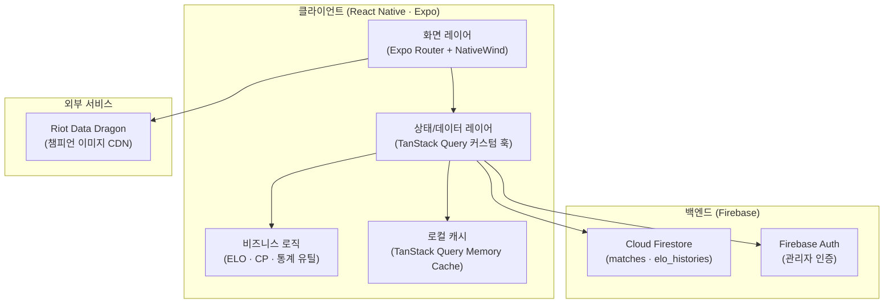
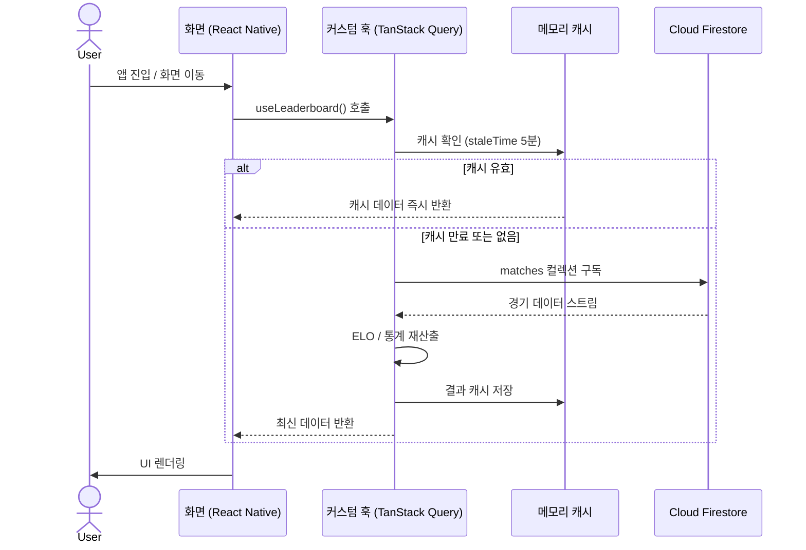

# ARCHITECTURE — puri.gg Mobile
**시스템 아키텍처 문서 v1.0**
작성일: 2026-04-28

---

## 1. 전체 시스템 구조도



---

## 2. 레이어별 설명

### 2.1 화면 레이어 (Presentation Layer)

Expo Router의 파일 기반 라우팅으로 화면을 구성합니다. NativeWind를 통해 웹과 동일한 Tailwind 유틸리티 클래스 문법으로 스타일을 적용하여 웹-앱 간 디자인 일관성을 유지합니다.

```
app/
├── (tabs)/
│   ├── _layout.tsx        # Bottom Tab Navigator
│   ├── index.tsx          # 홈 (검색)
│   ├── leaderboard.tsx    # 리더보드
│   ├── records.tsx        # 전적 목록
│   └── stats.tsx          # 통계
├── summoner/
│   └── [name].tsx         # 소환사 상세
└── _layout.tsx            # 루트 레이아웃 (QueryClientProvider)
```

### 2.2 데이터 레이어 (Data Layer)

TanStack Query가 Firestore 비동기 요청을 관리합니다. 각 화면은 도메인별 커스텀 훅을 통해 데이터를 소비하며, 컴포넌트는 데이터 페칭 로직을 직접 알지 못합니다.

```
src/hooks/
├── useMatches.ts          # 전체 경기 목록
├── useLeaderboard.ts      # ELO 랭킹 (산출 포함)
└── useSummoner.ts         # 소환사별 통계
```

### 2.3 비즈니스 로직 레이어 (Domain Layer)

기존 Next.js 웹 서비스의 유틸 함수를 플랫폼 독립적인 순수 TypeScript로 이식합니다. React Native의 플랫폼 API에 의존하지 않으므로 웹·앱 간 공유가 가능합니다.

```
src/utils/
├── calculateElo.ts        # ELO 점수 산출
├── calculateStats.ts      # 소환사/챔피언 통계
├── cp.ts                  # CP(공헌도 점수) 계산
└── ddragon.ts             # Data Dragon URL 생성
```

---

## 3. 데이터 흐름도



---

## 4. Firestore 데이터 모델

```
/matches/{matchId}
  ├── date: string          # "2026-04-28"
  ├── winner: "blue" | "red"
  ├── blueTeam: Player[]
  └── redTeam: Player[]

Player {
  nickname: string
  champion: string
  position: string
  kills: number
  deaths: number
  assists: number
}

/elo_histories/{docId}
  ├── playerName: string
  ├── changeAmount: number
  ├── reason: string
  └── createdAt: Timestamp
```

---

## 5. ADR (Architecture Decision Records)

### ADR-001: React Native (Expo) 채택

**날짜**: 2026-04-28
**상태**: 승인됨

**맥락**
기존 웹을 모바일로 확장할 때 Flutter, Swift/Kotlin 네이티브, React Native 세 가지 선택지를 검토했습니다.

**결정**
React Native (Expo) 채택.

**근거**
- 기존 웹 코드베이스가 TypeScript + React 기반이므로 **팀의 학습 비용이 최소화**됩니다.
- 비즈니스 로직(`calculateElo.ts`, `cp.ts` 등)을 **그대로 이식** 가능합니다.
- Expo EAS Build로 iOS · Android를 **단일 코드베이스**에서 빌드할 수 있습니다.
- Flutter는 Dart 학습 비용, 네이티브는 플랫폼별 이중 유지보수 비용이 발생합니다.

**트레이드오프**
- 고성능 애니메이션이 필요한 경우 네이티브 대비 제약이 있으나, 본 서비스는 리스트/카드 중심 UI로 해당 없음.

---

### ADR-002: TanStack Query 채택

**날짜**: 2026-04-28
**상태**: 승인됨

**맥락**
Firestore 실시간 구독과 상태 관리를 위해 Zustand + 직접 구독, Redux Toolkit Query, TanStack Query 세 가지를 검토했습니다.

**결정**
TanStack Query 채택.

**근거**
- `staleTime` / `gcTime` 설정만으로 **오프라인 캐시 전략**을 선언적으로 구성할 수 있습니다.
- `useQuery` 훅이 로딩·에러·성공 상태를 **자동 관리**하여 보일러플레이트를 줄입니다.
- Firestore `onSnapshot` 리스너를 `queryClient.setQueryData`와 결합하면 **실시간 업데이트**를 캐시 레이어에 통합할 수 있습니다.
- 기존 웹 서비스에서도 동일 라이브러리를 사용하므로 팀 내 학습 곡선이 없습니다.

**트레이드오프**
- 단순 전역 상태(설정값 등)는 TanStack Query보다 Zustand가 적합하나, 해당 케이스는 `AsyncStorage`로 충분히 처리 가능.

---

### ADR-003: NativeWind 채택

**날짜**: 2026-04-28
**상태**: 승인됨

**맥락**
모바일 스타일링 방식으로 StyleSheet API, Styled Components, NativeWind를 검토했습니다.

**결정**
NativeWind v4 채택.

**근거**
- 기존 웹의 Tailwind CSS 클래스를 **동일한 문법**으로 재사용하여 디자인 일관성을 보장합니다.
- LoL 골드 테마(`#c8aa6e`) 등 CSS 변수를 `tailwind.config.js`에서 공유할 수 있습니다.
- StyleSheet API보다 **빠른 프로토타이핑**이 가능합니다.
